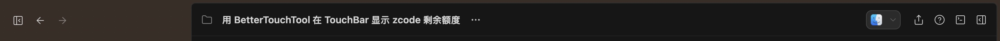

# ZQuota

**在 MacBook Pro Touch Bar 上实时监控 ZCode Coding Plan 剩余额度的 macOS 原生工具。**

ZQuota 将 ZCode 的额度使用情况展示在 Touch Bar、macOS 菜单栏和桌面 HUD 浮窗中，通过直观的分段电量条查看短期与每周额度，帮助你随时掌握剩余额度及重置时间。

* **Touch Bar**：双行分段电量条，ZCode 前台时显示，展示 5 小时额度、周额度、重置时间与重置倒计时。
* **菜单栏**：紧凑展示两种额度的剩余比例，悬停查看 MCP 工具剩余次数和订阅档位。
* **桌面 HUD**：可拖动的胶囊浮窗（默认隐藏），支持自定义颜色和透明度，刷新按钮带旋转动画与悬停反馈。

本项目基于 [TouchBarCodexToken](https://github.com/jackchensky/TouchBarCodexToken) 改造，保留其 Touch Bar 可视化设计思路，将数据源替换为 ZCode 官方额度接口，并针对 ZCode 桌面端和 CLI 的使用方式调整应用生命周期。

## 效果预览

Touch Bar 上的双行分段电量条，分别展示 5 小时额度与周额度的剩余比例、重置时间与倒计时：


## 功能特性

* **双窗口额度监控**：分别展示 5 小时额度和周额度。
* **分段电量条**：根据剩余比例自动切换颜色，快速识别额度紧张程度。
* **多位置展示**：Touch Bar 常驻、菜单栏常驻、桌面 HUD 按需显示。
* **重置信息双呈现**：每行同时显示绝对重置时间（`10月09日 13:01 重置`）与相对倒计时（`2时31分后重置`）。
* **Touch Bar 跟随前台**：额度条仅在 ZCode 桌面端处于前台时呈现，切换到其他应用（微信、Trae 等）自动隐藏，避免遮挡其原生 Touch Bar；可通过菜单栏「在 ZCode 前台时显示」开关，默认开启，状态持久化。
* **自动刷新**：每 30 秒获取一次最新额度（Touch Bar 上的刷新按钮可手动触发）。
* **异常容错**：刷新失败时保留上一组有效数据；连续 10 分钟未成功刷新时，菜单栏标题加 ⚠ 前缀、Touch Bar 刷新按钮切换为黄色 ⚠，提示当前显示的是过期数据。
* **自动跟随登录状态**：读取 ZCode 本地凭据，无需单独配置 API Key。
* **常驻运行**：不依赖某个 CLI 会话持续运行，并可通过 LaunchAgent 在检测到 ZCode 桌面端或 CLI 运行时自动拉起。

## 效果与显示内容

### 菜单栏

```text
⚡ 5h 84%  W 50%
```

紧凑显示 5 小时额度和周额度的剩余比例。悬停可查看 MCP 工具剩余次数及当前订阅档位。

### Touch Bar

```text
× [Z 图标] 5 小时 ▓▓▓░░░░ 剩余 42%  10月09日 13:01 重置 | 2时31分后重置
           周限额 ▓▓▓▓▓▓░ 剩余 65%  10月15日 23:00 重置 | 6天12时后重置
```

* 仅当 ZCode 桌面端处于前台时以系统模态方式呈现；切到其他应用自动隐藏，回到 ZCode 自动恢复。
* 条上 `×` 或菜单栏「在 ZCode 前台时显示」可关闭；菜单开关重新开启。
* HUD 浮窗上的 `×` 仅隐藏浮窗，不退出应用；退出请用菜单栏「退出」。

### 桌面 HUD

```text
● 5h 42%  ● 7d 65%  ↻ ×
```

* 默认隐藏，通过菜单栏「显示浮窗」打开。
* 支持拖动位置、自定义颜色和透明度。
* 刷新按钮点击后旋转直至刷新完成；按钮均有悬停高亮反馈。

### 额度与颜色规则

| 项目       | 说明                              |
| -------- | ------------------------------- |
| 5 小时额度   | 从 `TOKENS_LIMIT` 中选取最先重置的额度窗口   |
| 周额度      | 从 `TOKENS_LIMIT` 中选取次后重置的额度窗口   |
| MCP 工具次数 | 根据 `TIME_LIMIT` 数据映射，悬停菜单栏图标可见 |
| 红色       | 剩余比例 ≤ 20%                      |
| 黄色       | 剩余比例 > 20% 且 ≤ 45%              |
| 荧光绿      | 剩余比例 > 45%                      |

> 以上窗口映射基于当前接口数据结构。若 ZCode 调整额度类型或重置规则，需要同步检查映射逻辑。

其中，MCP 工具月度额度为 1000 次，当前统计涉及 `search-prime`、`web-reader` 和 `zread`。

## 环境要求

* macOS 11 或更高版本。
* Xcode 命令行工具。
* Swift 5.8 或更高版本。
* 带 Touch Bar 的 MacBook Pro 才能使用 Touch Bar 展示功能。

菜单栏和桌面 HUD 不依赖 Touch Bar 硬件，但 Touch Bar 展示功能仅适用于配备该硬件的 MacBook Pro。

## 安装

Releases 提供 DMG 格式安装包（`ZQuota-<版本号>-macOS.dmg`）：

1. 到 [Releases](https://github.com/stevenwangking/zquota/releases) 下载 DMG，双击挂载。
2. 将盘面上的 `ZQuota.app` 拖到 `Applications` 快捷方式。
3. 首次启动若被 Gatekeeper 拦截（ad-hoc 签名，非 Developer ID / Mac App Store 签名），任选一种方式放行：
   * 在 Finder 中右键（控制点按）`ZQuota.app` → 打开 → 确认运行；或
   * 系统设置 → 隐私与安全性 → 在 ZQuota 被阻止的提示中点「仍要打开」。
4. 启动后菜单栏出现 ZCode 图标；应用常驻运行，并注册 LaunchAgent 在检测到 ZCode 时自动拉起。

卸载见本文末尾「卸载」一节。

## 构建与运行

在项目根目录执行：

```bash
./scripts/build-app.sh
```

构建产物：

```text
build/ZQuota.app
```

构建脚本负责编译、打包及 ad-hoc 签名。该签名不等同于 Developer ID 签名或 Mac App Store 分发签名。可选版本号参数会在签名前写入应用内的 `CFBundleShortVersionString`（DMG 脚本会自动传入，保证文件名与应用版本一致）：

```bash
./scripts/build-app.sh [版本号]
```

生成 DMG 安装盘（与 Releases 中的安装包格式一致）：

```bash
./scripts/build-dmg.sh [版本号] [输出目录]
```

版本号缺省为 `0.1.0`，输出目录缺省为仓库根下的 `dist/`。

构建完成后，可根据需要将 `ZQuota.app` 移动到 `/Applications`，再按项目配置启动应用。

## 数据获取与处理

ZQuota 直接读取 ZCode 的本地登录凭据，并调用额度接口获取使用情况。

### 数据链路

1. **读取凭据**

   从 `~/.zcode/v2/credentials.json` 读取 `oauth:bigmodel:access_token`。

2. **本地解密**

   对 `enc:v1:` 格式的凭据执行 AES-256-GCM 解密。

   密钥来源为以下两种方式之一：

   * 环境变量 `ZCODE_CREDENTIAL_SECRET`。
   * 回退密钥：`SHA256("zcode-credential-fallback:darwin:<home>:<user>")`。

3. **请求额度接口**

   ```http
   GET https://api.z.ai/api/monitor/usage/quota/limit
   Authorization: Bearer <access_token>
   ```

4. **解析额度数据**

   根据 `TOKENS_LIMIT` 的重置时间排序映射 5 小时窗口和周窗口，并根据 `TIME_LIMIT` 数据映射 MCP 工具剩余次数。

### 数据安全

* 凭据解密在本机完成。
* 额度查询由本机直接发起。
* 不将访问令牌写入独立的持久化文件，也不主动上传访问令牌。
* 额度刷新失败时保留上一组有效数据显示。

**安全说明：** 上述说明描述的是预期的数据处理方式。实际安全性还取决于日志、崩溃报告、进程间通信及其他代码路径是否会暴露凭据。

## BetterTouchTool 版（btt/）

针对已通过 [BetterTouchTool](https://www.folivora.ai) 自定义 Touch Bar 的场景，仓库提供等价的 BTT 部署方案（要求系统设置「触控栏显示」为 App 控制模式）：

* **视觉规格与 APP 版一致**：分段电量条由 `btt/render-bars.swift` 按APP 版 `SegmentedBatteryBar` 的绘制参数（10 段、段距、圆角、三档配色）渲染为 @2x PNG；文本双行布局、倒计时文案与 `TouchBarRateLimitsView` 对齐。
* **数据链路复用**：`~/.local/bin/zquota-btt`（Node）复用凭据解密与额度接口调用，带 25 秒 JSON 缓存；电量条 PNG 按剩余比例组合懒渲染并落盘复用。
* **部署**：`btt/install.sh` 通过 BTT 的 AppleScript 接口幂等创建三个条目——ZCode 图标、主 widget（30 秒自刷新）、刷新按钮；点击 widget 或刷新按钮即时重拉数据上屏。
* 与 APP 版可共存，各自独立刷新互不干扰；卸载时在 BTT 中删除 `ZQuota` / `ZQuotaIcon` / `ZQuotaRefresh` 三个条目即可。

```bash
./btt/install.sh
```



## 发版流程（维护者）

发版已自动化：推送 `v*` tag 后，GitHub Actions 在 macOS 云端 runner 上构建 DMG、从 CHANGELOG.md 提取该版本段落作为发布说明，自动创建 Release 并上传安装包。ZCode 中执行 `/release 0.3.0`（或直接说「发布 0.3.0」）即可完成全流程——更新版本号、归纳 CHANGELOG、提交打 tag 并验证 CI 产出发版链接（见 `.zcode/skills/release`）。手动等价操作：更新 `Resources/Info.plist` 版本号与 CHANGELOG.md，提交推送后执行 `git tag -a v0.3.0 -m "..." && git push origin v0.3.0`。

## 已知限制

ZCode 官方 UI 存在「{count} 次重置额度」概念（5 小时窗与周窗各自的重置券次数），对应接口 `zcode.z.ai/api/v1/coding-plan/reset/status`（返回 `available_five_hour_resets` / `available_week_resets`）。该接口鉴权可用本机 `zcodejwttoken` 通过，但其业务必填参数由 ZCode 客户端内部封装注入，尚未逆向出来，因此 Touch Bar 尾列暂显示重置倒计时。攻破该接口后，替换 `TouchBarRateLimitsView.resetCountdownText` 即可切换为次数显示。

## 与原项目的区别

ZQuota 基于 [TouchBarCodexToken](https://github.com/jackchensky/TouchBarCodexToken) 改造，主要变化如下：

| 对比项   | 原项目                                          | ZQuota                               |
| ----- | -------------------------------------------- | ------------------------------------ |
| 数据来源 | Codex app-server 的 `account/rateLimits/read` | ZCode 额度接口                           |
| 额度展示 | Codex 相关使用限制及统计                              | 5 小时额度、周额度、重置倒计时                     |
| 补充信息 | 重置券、点数余额、历史 Token 等                          | MCP 工具剩余次数、订阅档位（菜单栏悬停）               |
| Touch Bar 呈现 | 点击 HUD 激活窗口接管                          | 系统模态、仅 ZCode 前台时呈现（经 ObjC shim 调用运行时仍存在的 API，macOS 15 SDK 已移除其声明） |
| 生命周期 | 随 Codex 退出而退出                                | 常驻运行，并可按需自动拉起                        |
| 应用图标 | Codex 相关图标                                   | 优先读取 `/Applications/ZCode.app` 的应用图标 |

## 项目结构

```text
zquota/
├── .github/workflows/          CI：推送 v* tag 自动打包发布 Release
├── .zcode/skills/              ZCode 项目 skill（/release 一句话发版）
├── assets/                     README 效果图
│   └── zquota-touchbar.png
├── Package.swift               含 ObjC shim target
├── Shim/                       桥接被 SDK 移除、运行时仍存在的 Touch Bar API
│   ├── include/ZCodeTouchBar.h
│   └── ZCodeTouchBar.m
├── Sources/
│   ├── ZCodeQuotaClient.swift
│   ├── RateLimitStore.swift
│   ├── LimitModels.swift
│   ├── AppDelegate.swift
│   ├── CompactHUDViewController.swift
│   ├── TouchBarRateLimitsView.swift
│   ├── SegmentedBatteryBar.swift
│   ├── HUDAppearance.swift
│   ├── CompactHUDPanel.swift
│   ├── ZCodeAutoLauncher.swift
│   └── main.swift
├── Resources/
│   ├── Info.plist
│   ├── AppIcon.icns
│   └── zquota-launcher.sh
├── btt/                        BetterTouchTool 版
│   ├── render-bars.swift       分段电量条 PNG 渲染器（绘制参数与 APP 版一致）
│   ├── install.sh              BTT 条目幂等部署脚本
│   └── icons/                  Z 图标、刷新图标与懒渲染的电量条 PNG
├── scripts/
│   ├── build-app.sh
│   └── build-dmg.sh
├── LICENSE
├── CHANGELOG.md                 更新日志
└── README.md
```

* `Shim/`：ObjC 桥接层，重新声明 `NSTouchBar` 系统模态 API 供 Swift 调用。
* `ZCodeQuotaClient.swift`：读取、解密本地凭据并请求额度接口。
* `RateLimitStore.swift`：定时刷新数据、维护额度状态并向界面分发。
* `LimitModels.swift`：定义额度和展示数据模型。
* `AppDelegate.swift`：装配菜单栏、Touch Bar 开关、HUD 和应用生命周期。
* `CompactHUDViewController.swift`：实现 HUD 界面、Touch Bar 呈现与按钮动效。
* `TouchBarRateLimitsView.swift`：Touch Bar 双行额度视图（含重置倒计时）。
* `SegmentedBatteryBar.swift`：分段电量条组件。
* `HUDAppearance.swift`：管理 HUD 外观设置。
* `CompactHUDPanel.swift`：实现无边框 HUD 面板。
* `ZCodeAutoLauncher.swift`：管理 LaunchAgent 自动拉起逻辑。

## 卸载

1. 点击菜单栏图标，退出 ZQuota。
2. 删除 `ZQuota.app`。
3. 如果应用注册了 LaunchAgent，执行以下命令清理：

```bash
launchctl bootout gui/$(id -u) \
  "$HOME/Library/LaunchAgents/com.steven.ZQuota.Launcher.plist"

rm -f "$HOME/Library/LaunchAgents/com.steven.ZQuota.Launcher.plist"

rm -rf "$HOME/Library/Application Support/ZQuota"
```

如果 LaunchAgent 已经退出或未加载，`bootout` 可能提示找不到服务；这不影响后续删除文件。

## 致谢与许可

本项目基于 [TouchBarCodexToken](https://github.com/jackchensky/TouchBarCodexToken) 改造。原项目采用 MIT License，作者为 Jack Chen。

发布时请保留原项目要求的版权声明与许可证，并根据实际修改和新增代码情况补充本项目的许可证及第三方依赖声明。
